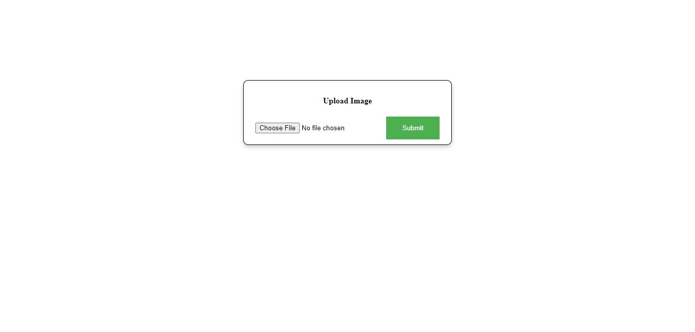
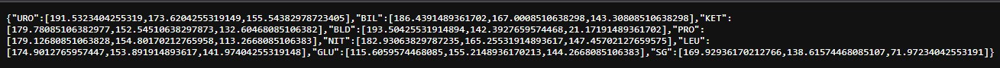

# urine-strip-detection

This Projects involves a web interface that allows users to upload an image of their
urine strip and identify the colors on the strip . Each strip
will have 10 colors. It analyzes the image and return the
results as a json with 10 colors (RGB values) doing urinalysis of the image.

## Requirements

This module requires the following modules:

- Node.js
- Python
- OpenCV

## Installation

- Intalling node modules
 ```npm install```
- Install python modules
 ```pip install -r requirements.txt```

## Working

### Sample urine strip


### Interface


### Results
